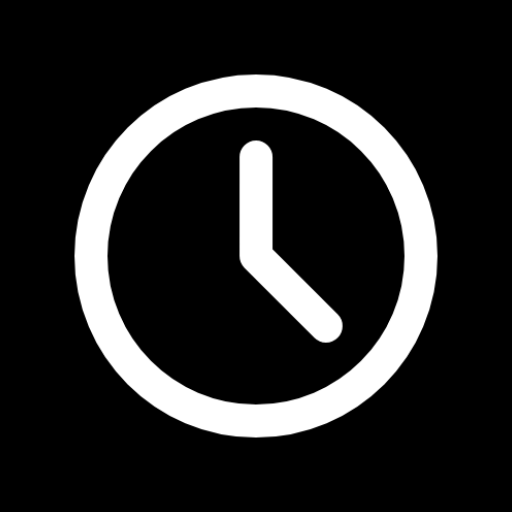

# Desk Clock Lite

[简体中文](./README.zh.md) |
**English** |
<small>More translations are welcome!</small>

This is a multi-platform program.

Some codes may not be implemented well. I hope you can tell me in issues.

For Bright Mode, you click on the upper right area and the software will display a button to switch color modes.

This repository is hosted on [GitLab](https://gitlab.com/HelloTool/DeskClockLite), with [GitHub](https://github.com/HelloTool/DeskClockLite), [Gitee](https://gitee.com/HelloTool/DeskClockLite) as mirrors.

## Download

Goto [GitLab Release](https://gitlab.com/Jesse205/Desk-Clock-Lite/-/releases).

## Thanks

- **[IconPark](https://iconpark.oceanengine.com/official)**: App icon

## Communicate

- QQ Group - [Edde 学习桌交流群](https://jq.qq.com/?_wv=1027&k=xBZAOI2D)
- QQ Group - [Edde 综合交流群](https://jq.qq.com/?_wv=1027&k=54XFVLSq)
