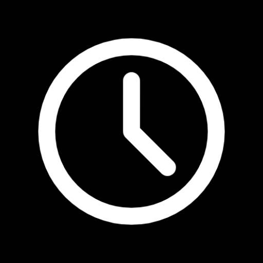

# 桌面时钟 Lite

**简体中文** |
[English](./README.md) |
<small>期待你的翻译！</small>

这是个多平台的项目。

一些代码可能实现得不是那么的好。希望您可以在 issues 内纠正我一些问题。

对于亮色模式，您点击右上角区域，软件将显示切换颜色模式的按钮。

本仓库以 [GitLab](https://gitlab.com/HelloTool/DeskClockLite)
为主， [GitHub](https://github.com/HelloTool/DeskClockLite)、[Gitee](https://gitee.com/HelloTool/DeskClockLite) 为镜像。

## 下载

前往 [GitLab Release](https://gitlab.com/Jesse205/Desk-Clock-Lite/-/releases)。

## 兼容性

| 平台              | 版本 |
| ----------------- | ---- |
| Android           | 2.3+ |
| OpenHarmony       | ？   |
| Internet Explorer | 9+   |
| Chrome            | ？   |
| 传统 Edge         | ？   |

## 感谢

- **[IconPark](https://iconpark.oceanengine.com/official)**: 软件图标

## 交流

- QQ 群 - [Edde 学习桌交流群](https://jq.qq.com/?_wv=1027&k=xBZAOI2D)
- QQ 群 - [Edde 综合交流群](https://jq.qq.com/?_wv=1027&k=54XFVLSq)
